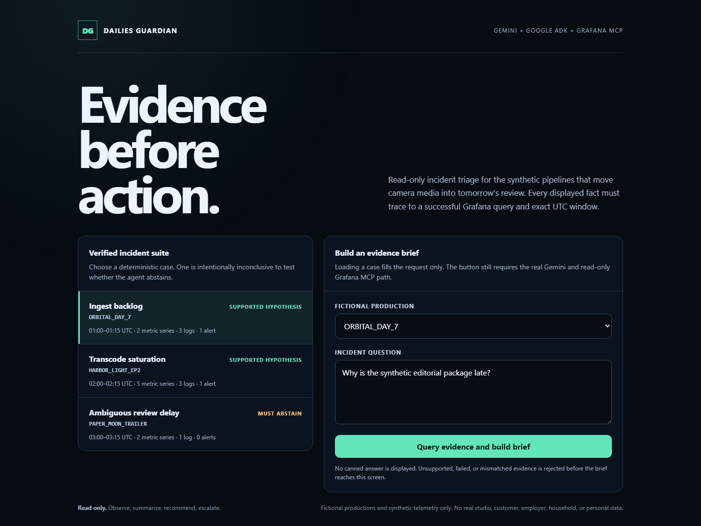

# Dailies Guardian

Dailies Guardian is a new, synthetic-only Agentic Cinema entry for the
Grafana track. It helps a film or episodic post-production team understand a
failing dailies pipeline before a review session is missed.

The runtime design is deliberately narrow:

1. a user describes a delayed review or ingest incident;
2. a Gemini agent built with Google Agent Development Kit queries the official
   `grafana/mcp-grafana` server in read-only mode;
3. the agent correlates synthetic pipeline metrics, logs, dashboards, and
   alerts; and
4. it returns an evidence-linked incident brief with explicit unknowns and
   reversible next actions.

No employer systems, customer data, home-network details, personal recordings,
or existing Bee project code are used. All demo productions, people, services,
and incidents are fictional.



The screenshot is a real local render of the checked-in synthetic fixture UI.
It is not a hosted-demo claim and does not depict a completed Gemini response.

## Current evidence

- New project created during the official July 27–September 7, 2026 contest
  period.
- The runtime imports Google ADK and launches the official Grafana MCP server
  v1.0.0 from a source-pinned container build.
- Grafana is forced into `--disable-write` mode.
- Pure policy and privacy tests run without cloud credentials.
- The pinned Docker image builds successfully and its non-root container serves
  `/healthz`, the fixture catalog, and the responsive UI with HTTP 200 in a
  local smoke test.
- A no-operation MCP discovery check confirmed every configured tool name is
  present in the official Grafana MCP v1.0.0 server; the app exposes only five
  read operations (data sources, dashboard search/read, Prometheus, and Loki).
- A digest-pinned disposable Grafana 12.1.0 + Loki 3.5.1 stack provisions the
  checked-in synthetic datasource and three-panel dashboard. An ephemeral
  Viewer token drove the actual official MCP v1.0.0 stdio server through
  `list_datasources`, `search_dashboards`, `get_dashboard_by_uid`, and
  `query_loki_logs`; all three fictional productions were observed and writes
  remained disabled. The loopback-only containers and network were removed.
- A runtime evidence ledger matches every displayed observed-fact citation to
  an actual successful read-only Grafana query and its exact absolute UTC
  window. Fabricated, failed, relative-window, or write-tool evidence fails
  closed with a generic response.
- Input and output privacy gates reject contact details, local/private network
  values, URLs, credentials, confidential markers, and token-like strings.
- `fixtures/telemetry_v1.json` contains three deterministic, fictional
  15-minute incidents: ingest retries, transcode saturation, and a deliberately
  inconclusive review delay that the public response contract must not turn
  into a root-cause claim.
- `scripts/export_fixture.py` deterministically emits credential-free
  OpenMetrics, Loki JSON push, public case-index, and SHA-256 manifest artifacts.
  These are provider-neutral seed files; they are not presented as proof of a
  Grafana Cloud upload.
- An objective 100-point evaluation harness makes the evidence contract worth
  40 points, case-specific observed evidence 30, uncertainty calibration 20,
  and reversible action/escalation 10. Unsupported or causal answers cannot
  score like evidence-complete briefs.
- `scripts/export_evaluation_receipt.py` produces a deterministic, credential-free
  public receipt that binds all three canonical briefs to the fixture SHA-256,
  exact observed query windows, score breakdowns, and explicit abstention for
  the ambiguous case. A mismatched citation fails closed instead of producing a
  passing receipt.
- Sixty-four policy, privacy, fixture, integration, export, evaluation, release,
  API-contract, and
  configuration tests pass locally.
- A credential-free GitHub Actions workflow rebuilds the exact allowlisted
  public candidate, verifies every manifest hash and exclusion, reruns all
  tests from that clean tree, and smoke-tests the non-root container's health,
  UI, fixture catalog, and bundled Grafana MCP license. It does not call Gemini,
  Grafana Cloud, or the analysis endpoint.
- Desktop and 390-pixel mobile browser checks confirm all three fixture cases
  render, selecting the abstention case updates the form, the primary action is
  visible, and the UI clearly distinguishes case loading from real analysis.
- The allowlisted public repository and credential-free CI are verified. A real
  Gemini/Google Cloud + Grafana Cloud run, hosted URL, and demo video are **not
  yet claimed**.

## Local checks

```powershell
python -m unittest discover -s tests -v
python -m compileall -q src tests fixtures
python scripts/export_fixture.py
python scripts/export_evaluation_receipt.py
python scripts/build_public_release.py
powershell -File scripts/smoke_loki.ps1
powershell -File scripts/smoke_grafana_mcp.ps1
```

## Cloud integration gate

Bradley must personally join the Devpost event, accept Google Cloud and Grafana
terms, and create contest-only accounts/credentials. Do not commit credentials.
The required private environment values are documented in `.env.example`.

Once those accounts exist:

```powershell
python -m venv .venv
.\.venv\Scripts\Activate.ps1
python -m pip install -e .
$env:PYTHONPATH = "$PWD\src"
uvicorn dailies_guardian.service:app --reload
```

## Contest compliance boundary

The submitted runtime will use only Gemini/Google Cloud AI plus Grafana's
built-in capabilities. No OpenAI, Anthropic, Microsoft, AWS, local LLM, or
third-party agent framework is imported or called by the project. Codex may
assist with preparation, but no non-permitted model becomes part of the
submitted application or hosted runtime.

See `docs/CONTEST_REQUIREMENTS.md`, `docs/PRIVACY.md`, and
`docs/RUBRIC_PLAN.md` for the evidence plan and remaining gates. The telemetry
wire formats and scoring contract are documented in
`docs/TELEMETRY_EVALUATION.md`. Draft submission copy, the architecture flow,
demo shot plan, and internal readiness audit are in
`docs/DEVPOST_SUBMISSION_DRAFT.md`, `docs/ARCHITECTURE.md`,
`docs/DEMO_STORYBOARD.md`, and `docs/RUBRIC_AUDIT_DRAFT.md`. The deterministic,
allowlisted repository-candidate process is documented in
`docs/PUBLIC_RELEASE.md`.

Exact Linux runtime constraints are recorded in `requirements.lock`; direct
dependencies and the bundled Grafana MCP binary are attributed in
`THIRD_PARTY_NOTICES.md`. The Docker build context is restricted by
`.dockerignore` so local environments, private artifacts, tests, and internal
review notes are never transmitted to the image builder.
