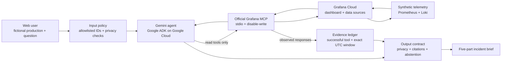

# Architecture and evidence flow

The final hosted path has one job: turn a question into a brief whose factual
claims can be traced to successful Grafana reads.

## Trust boundaries

- The browser can send only one of three published fictional production IDs.
- Input privacy checks run before Gemini.
- Grafana uses a contest-only least-privilege service account.
- The MCP subprocess starts with writes disabled and a read-tool allowlist.
- Discovery calls provide context; only successful time-bounded queries can
  support observed facts.
- The evidence ledger is runtime state, not text supplied by the model.
- The output contract runs before the browser receives the brief.
- A contract failure returns a generic error rather than partial model output.

## Evidence already captured

The local integration uses the same official MCP binary and checked-in Grafana
assets intended for the final path. It has verified four reads against
digest-pinned disposable Grafana/Loki services. This proves the partner
connection and evidence shape locally. It does not prove the still-pending
Gemini/Google Cloud or Grafana Cloud deployment.
